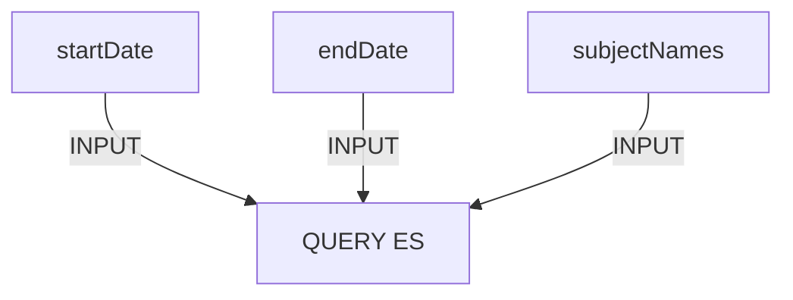

# Overview
This model consists of two parts. Part 1 consists of assessing the amount of traffic related to a reward offer 'subject' and a second part, Part 2, which consists of clustering documents based on the LaBSE vector and an author's follower count. 

## Model Process
1. Collect Historical Data
2. Establish 'subject' thresholds (97.5% confidence)
3. Train clustering model (3 clusters)
4. Collect new data (previous day)
5. Compare to threshold
6. Run clustering model
7. Log data points
8. Alert team
9. Provide content (cluster examples)

## Model Functional Flow

